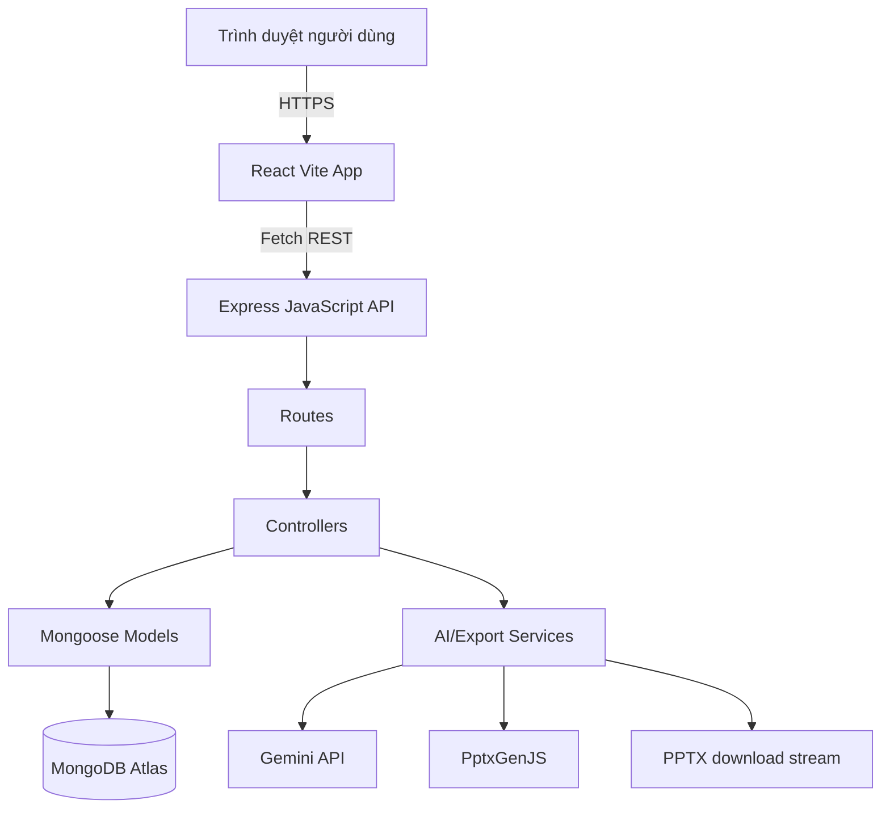

# DeckAI - Thiết kế hệ thống AI Slide Generator

## Tổng quan kiến trúc



DeckAI dùng kiến trúc MERN với backend theo mô hình MVC. Frontend là React SPA viết bằng JavaScript và CSS thuần, giao tiếp với Express API. Backend chịu trách nhiệm xác thực, phân quyền, lưu trữ dữ liệu, điều phối AI và tạo file export.

Trong REST API, View không phải server-rendered HTML mà là JSON response/DTO trả về cho frontend. Các service tích hợp như Gemini và PptxGenJS vẫn có thể tồn tại, nhưng chúng là helper/integration service được controller gọi khi cần, không thay thế cấu trúc MVC chính.

## Cấu trúc thư mục đề xuất

```txt
Backend/
  src/
    config/
      db.js
      env.js
      gemini.js
    controllers/
      auth.controller.js
      user.controller.js
      deck.controller.js
      outline.controller.js
      slide.controller.js
      export.controller.js
    models/
      User.model.js
      Deck.model.js
      Slide.model.js
      SlideVersion.model.js
      ExportHistory.model.js
    routes/
      auth.routes.js
      user.routes.js
      deck.routes.js
      outline.routes.js
      slide.routes.js
      export.routes.js
    services/
      gemini.service.js
      pptxExport.service.js
    middleware/
      authMiddleware.js
      errorMiddleware.js
      validateRequest.js
    validators/
      auth.validator.js
      deck.validator.js
      slide.validator.js
    utils/
      ApiError.js
      asyncHandler.js
    app.js
    server.js

Frontend/
  src/
    app/
      providers.jsx
    pages/
      LandingPage.jsx
      LoginPage.jsx
      RegisterPage.jsx
      DashboardPage.jsx
      MyPresentationsPage.jsx
      CreatePresentationPage.jsx
      OutlineEditorPage.jsx
      SlideEditorPage.jsx
      PresentationPreviewPage.jsx
    components/
      auth/
      dashboard/
      deck/
      outline/
      slide-editor/
      preview/
      common/
    services/
      apiClient.js
      authApi.js
      deckApi.js
      slideApi.js
      exportApi.js
    stores/
      authStore.js
      deckStore.js
      editorStore.js
    styles/
      base.css
      layout.css
      components.css
```

## Data model

### User
```ts
{
  _id: ObjectId;
  fullName: string;
  email: string;
  passwordHash: string;
  avatar?: string;
  createdAt: Date;
  updatedAt: Date;
}
```

### Deck
```ts
{
  _id: ObjectId;
  userId: ObjectId;
  title: string;
  topic: string;
  description?: string;
  language: "English" | "en";
  tone: "professional" | "academic" | "persuasive" | "simple";
  slideCount: number;
  status: "draft" | "outline_ready" | "generating" | "ready" | "failed";
  outline?: {
    sections: Array<{
      id: string;
      title: string;
      summary?: string;
      order: number;
    }>;
  };
  createdAt: Date;
  updatedAt: Date;
}
```

### Slide
```ts
{
  _id: ObjectId;
  deckId: ObjectId;
  slideNumber: number;
  title: string;
  content: string[];
  speakerNotes?: string;
  layout: "title" | "content" | "two_column" | "section" | "summary";
  createdAt: Date;
  updatedAt: Date;
}
```

### SlideVersion
```ts
{
  _id: ObjectId;
  slideId: ObjectId;
  title: string;
  content: string[];
  speakerNotes?: string;
  layout?: string;
  versionNumber: number;
  reason?: string;
  createdAt: Date;
}
```

### ExportHistory
```ts
{
  _id: ObjectId;
  deckId: ObjectId;
  userId: ObjectId;
  format: "pptx";
  fileName: string;
  createdAt: Date;
}
```

## Thiết kế REST API

### Auth
```txt
POST /api/auth/register
POST /api/auth/login
POST /api/auth/logout
GET  /api/auth/me
```

Trong MVP, `POST /api/auth/logout` chỉ trả success để frontend đồng bộ luồng đăng xuất. JWT/session được xóa ở phía frontend; backend chưa cần token blacklist hoặc refresh-token revocation.

### Decks
```txt
GET    /api/decks
GET    /api/decks/stats/summary
GET    /api/decks/:deckId
POST   /api/decks
PATCH  /api/decks/:deckId
DELETE /api/decks/:deckId
```

### Outline
```txt
POST /api/decks/:deckId/outline/generate
GET  /api/decks/:deckId/outline
PUT  /api/decks/:deckId/outline
POST /api/decks/:deckId/slides/generate
```

### Slides
```txt
GET    /api/decks/:deckId/slides
POST   /api/decks/:deckId/slides
PATCH  /api/slides/:slideId
DELETE /api/slides/:slideId
PATCH  /api/decks/:deckId/slides/reorder
POST   /api/slides/:slideId/regenerate
GET    /api/slides/:slideId/versions
```

### Exports
```txt
POST /api/decks/:deckId/export/pptx
GET  /api/decks/:deckId/exports
```

MVP không hỗ trợ tải lại file PPTX cũ từ export history vì file PPTX không được lưu vĩnh viễn. `GET /api/decks/:deckId/exports` chỉ trả metadata lịch sử export.

Tất cả endpoint liên quan đến deck, slide, version và export phải kiểm tra quyền sở hữu dựa trên user đã xác thực.

## Kiến trúc component frontend
- AuthForm: form dùng chung cho đăng nhập và đăng ký.
- DashboardStats: tổng số deck và hoạt động gần đây.
- RecentDeckList và DeckCard: danh sách presentation cho Dashboard và My Presentations.
- CreatePresentationForm: nhập topic, description, language, tone và slide count. MVP mặc định English, backend chỉ chấp nhận `English` hoặc `en`, tối đa 10 slide và các tone `professional`, `academic`, `simple`, `persuasive`.
- OutlineSectionList và OutlineSectionEditor: chỉnh sửa và sắp xếp outline.
- SlideNavigator: danh sách thumbnail slide theo thứ tự.
- SlideCanvas: vùng chỉnh sửa tiêu đề và nội dung slide dạng text-only.
- SlidePropertiesPanel: layout, notes, nút save rõ ràng và thao tác slide.
- SpeakerNotesEditor: nhập speaker notes.
- RegenerateSlideModal: tái tạo slide theo instruction.
- PresentationPreview: điều hướng slide ở chế độ trình chiếu.
- ExportButton: kích hoạt export PPTX và hiển thị trạng thái.

Layout editor nên có 3 vùng: thumbnail bên trái, vùng chỉnh sửa slide ở giữa và panel thuộc tính/hành động bên phải.

Slide editor trong MVP dùng explicit save. `editorStore` nên lưu dirty state của slide đang chỉnh; khi người dùng đổi slide, rời trang hoặc mở preview trong lúc còn thay đổi chưa lưu, frontend phải hiển thị cảnh báo. Sau khi lưu thành công, dirty state được clear và dữ liệu server là nguồn sự thật.

Backend và frontend không dùng TypeScript. Backend dùng `.js`; frontend component dùng file `.jsx`, logic dùng `.js`, style dùng CSS thuần trong thư mục `styles/` hoặc CSS module nếu cần giới hạn phạm vi style, không dùng TailwindCSS.

## Thiết kế backend MVC
- Routes: định nghĩa endpoint và middleware, sau đó chuyển request đến controller tương ứng.
- Controllers: xử lý request/response, điều phối nghiệp vụ, kiểm tra ownership, gọi model và helper service khi cần.
- Models: định nghĩa Mongoose schema, indexes, validation cơ bản và quan hệ dữ liệu.
- Views: với REST API, View là JSON response/DTO trả về frontend, không dùng server-rendered template trong MVP.
- Services: chỉ dùng cho phần tích hợp hoặc logic kỹ thuật phức tạp như Gemini, JSON validation/retry và PptxGenJS export.

Controller chính:
- `auth.controller.js`: đăng ký, đăng nhập, đăng xuất, current user.
- `deck.controller.js`: CRUD deck và dashboard stats.
- `outline.controller.js`: generate, get và update outline.
- `slide.controller.js`: CRUD slide, reorder, regenerate và version history.
- `export.controller.js`: tạo PPTX stream trực tiếp và trả export history metadata có phân quyền. MVP không có download lại file cũ từ history.

## Thiết kế AI service
Gemini phải được yêu cầu trả về strict JSON. Backend phải validate response trước khi ghi vào MongoDB.

Contract response outline:
```json
{
  "title": "string",
  "sections": [
    {
      "title": "string",
      "summary": "string"
    }
  ]
}
```

Contract response slide:
```json
{
  "slides": [
    {
      "title": "string",
      "content": ["string"],
      "speakerNotes": "string",
      "layout": "content"
    }
  ]
}
```

Trong MVP, `content` là mảng các dòng nội dung có thể đại diện cho bullet points hoặc paragraph ngắn. Hình ảnh, biểu đồ, bảng, rich text và kéo-thả thiết kế tự do không nằm trong MVP.

Regeneration cho một slide cần truyền topic của deck, language, tone, dữ liệu slide hiện tại, tiêu đề slide lân cận và instruction của người dùng. Trước khi cập nhật slide được chọn, hệ thống phải tạo SlideVersion.

Backend phải validate `language` chỉ là `English` hoặc `en` trước khi gọi Gemini. Các ngôn ngữ khác là future enhancement.

## Thiết kế export PPTX
Luồng export:
1. Xác thực user và kiểm tra quyền sở hữu deck.
2. Load deck và slide theo thứ tự `slideNumber`.
3. Tạo PPTX với theme mặc định.
4. Render title slide và content slide theo tập layout được hỗ trợ.
5. Thêm speaker notes nếu phù hợp.
6. Stream file `.pptx` trực tiếp về client.
7. Lưu ExportHistory metadata.
8. Không lưu file PPTX vĩnh viễn trong MVP.
9. Không tạo endpoint tải lại file cũ từ export history; lịch sử export chỉ dùng để xem metadata.

MVP export nên ưu tiên đúng thứ tự, chữ dễ đọc và format ổn định hơn là thiết kế phức tạp.

## Thiết kế bảo mật
- Hash mật khẩu bằng bcrypt.
- Lưu JWT secret và Gemini key trong biến môi trường.
- Không bao giờ expose Gemini credential ra frontend.
- Dùng auth middleware cho route được bảo vệ.
- Validate request body và route params.
- Enforce ownership trong controller hoặc helper dùng chung trước khi đọc/ghi model.
- Rate limit auth endpoint và AI endpoint.
- Cấu hình CORS allowlist.
- Export PPTX stream trực tiếp và export history metadata phải được phân quyền theo owner của deck.
- Sanitize nội dung do AI tạo trước khi render.

## Quyết định thiết kế
- Backend dùng MVC để dễ hiểu, dễ triển khai và phù hợp với Express/Mongoose. Service chỉ dùng cho tích hợp Gemini/PPTX hoặc logic kỹ thuật cần tách riêng.
- Lưu outline trong Deck cho MVP để đơn giản. Có thể tách collection Outline nếu cần lịch sử outline.
- MVP giới hạn 10 slide/deck, chỉ chấp nhận `language` là `English` hoặc `en` và 4 tone: `professional`, `academic`, `simple`, `persuasive`.
- MVP export PPTX bằng stream trực tiếp và chỉ lưu metadata trong ExportHistory; không hỗ trợ download lại file cũ từ history.
- MVP có 1 default theme chuyên nghiệp, chưa có template selector.
- Dùng AI call đồng bộ cho MVP với loading state rõ ràng. Thêm queue sau nếu latency là vấn đề production.
- Dùng enum layout cố định để editor và PPTX export dễ kiểm soát.
- MVP dùng React state cho UI/session/dirty state phía client; nếu mở rộng có thể bổ sung Zustand. Client state không thay thế server data.
- Lưu slide version cho regeneration history dù restore version có thể để sau.

## Yêu cầu phi chức năng
- Lỗi AI không được làm mất dữ liệu deck và slide hiện có.
- Reorder slide phải xử lý atomic trong controller hoặc helper transaction dùng chung và cập nhật lại `slideNumber` theo thứ tự mới.
- Delete slide phải renumber/recompact `slideNumber` của các slide còn lại để thứ tự không bị hổng.
- Export PPTX stream và export history metadata không được truy cập nếu chưa được phân quyền.
- API phải trả về error shape nhất quán.
- UI phải responsive trên desktop và mobile phổ biến.
